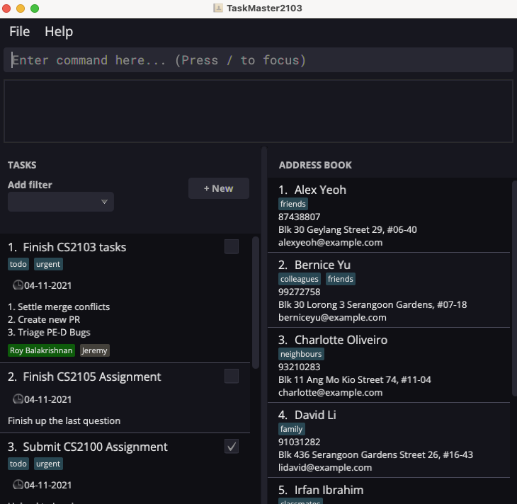
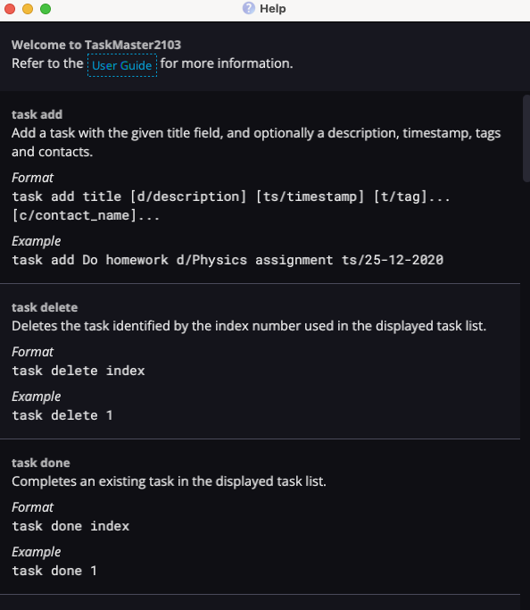

# User Guide V1.2

TaskMaster2103 V1.2 is a desktop app for managing contacts as well as tasks, optimized for
use via a CLI while still having the benefits of a GUI.

## Table of Contents

1. [Quick Start](#quickstart)
2. [Features](#features)
3. [FAQ](#faq)
4. [Command Summary](#commandsummary)

---

## Quick start

1. Ensure you have Java `11` or above installed in your Computer.

1. Download the latest `taskmaster.jar` from [here](https://github.com/AY2122S1-CS2103-F09-2/tp/releases).

1. Copy the file to the folder you want to use as the _home folder_ for your AddressBook.

1. Double-click the file to start the app. The GUI similar to the below should appear in a few seconds. Note how the app contains some sample data. 
   

1. Type the command in the command box and press Enter to execute it. e.g. typing **`help`** and pressing Enter will open the help window. 
   Some example commands you can try:

   - **`list`** : Lists all contacts.

   - **`add`**`n/John Doe p/98765432 e/johnd@example.com a/John street, block 123, #01-01` : Adds a contact named `John Doe` to the Address Book.

   - **`delete`**`3` : Deletes the 3rd contact shown in the current list.

   - **`clear`** : Deletes all contacts.

   - **`exit`** : Exits the app.

1. Refer to the [Features](#features) below for details of each command.

---

## Features

**:information_source: Notes about the command format:** 

- Words in `UPPER_CASE` are the parameters to be supplied by the user. 
  e.g. in `add n/NAME`, `NAME` is a parameter which can be used as `add n/John Doe`.

- Items in square brackets are optional. 
  e.g `n/NAME [t/TAG]` can be used as `n/John Doe t/friend` or as `n/John Doe`.

- Items with `…`​ after them can be used multiple times including zero times. 
  e.g. `[t/TAG]…​` can be used as ``(i.e. 0 times),`t/friend`, `t/friend t/family` etc.

- Parameters can be in any order. 
  e.g. if the command specifies `n/NAME p/PHONE_NUMBER`, `p/PHONE_NUMBER n/NAME` is also acceptable.

- Parameters must be provided exactly
  
    - If a parameter is expected only once in the command, but you specified it multiple times,
      an error message will be shown.
      
    - If an extraneous parameter is specified, an error message will be shown.

### Viewing help : `help`

Shows a message explaning how to access the help page.

Format: `help`

### Adding a person: `add`

Adds a person to the address book.

Format: `add n/NAME p/PHONE_NUMBER e/EMAIL a/ADDRESS [t/TAG]…​`

:bulb: **Tip:**
A person can have any number of tags (including 0)

Examples:

- `add n/John Doe p/98765432 e/johnd@example.com a/John street, block 123, #01-01`
- `add n/Betsy Crowe t/friend e/betsycrowe@example.com a/Newgate Prison p/1234567 t/criminal`

### Listing all persons : `list`

Shows a list of all persons in the address book.

Format: `list`

### Editing a person : `edit`

Edits an existing person in the address book.

Format: `edit INDEX [n/NAME] [p/PHONE] [e/EMAIL] [a/ADDRESS] [t/TAG]…​`

- Edits the person at the specified `INDEX`. The index refers to the index number shown in the displayed person list. The index **must be a positive integer** 1, 2, 3, …​
- At least one of the optional fields must be provided.
- Existing values will be updated to the input values.
- When editing tags, the existing tags of the person will be removed i.e adding of tags is not cumulative.
- You can remove all the person’s tags by typing `t/` without
  specifying any tags after it.

Examples:

- `edit 1 p/91234567 e/johndoe@example.com` Edits the phone number and email address of the 1st person to be `91234567` and `johndoe@example.com` respectively.
- `edit 2 n/Betsy Crower t/` Edits the name of the 2nd person to be `Betsy Crower` and clears all existing tags.

### Locating persons by name: `find`

Finds persons whose names contain any of the given keywords.

Format: `find KEYWORD [MORE_KEYWORDS]`

- The search is case-insensitive. e.g `hans` will match `Hans`
- The order of the keywords does not matter. e.g. `Hans Bo` will match `Bo Hans`
- Only the name is searched.
- Only full words will be matched e.g. `Han` will not match `Hans`
- Persons matching at least one keyword will be returned (i.e. `OR` search).
  e.g. `Hans Bo` will return `Hans Gruber`, `Bo Yang`

Examples:

- `find John` returns `john` and `John Doe`
- `find alex david` returns `Alex Yeoh`, `David Li` 
  

### Deleting a person : `delete`

Deletes the specified person from the address book.

Format: `delete INDEX`

- Deletes the person at the specified `INDEX`.
- The index refers to the index number shown in the displayed person list.
- The index **must be a positive integer** 1, 2, 3, …​

Examples:

- `list` followed by `delete 2` deletes the 2nd person in the address book.
- `find Betsy` followed by `delete 1` deletes the 1st person in the results of the `find` command.

### Listing tasks: `task list`

Lists all tasks in the task list. Clears any existing filters.

**Format:**

`task list`

#### Filtering tasks

Tasks can be filtered by completion status and/or tags. Show only completed tasks with `done/`, pending tasks with `undone/` and tasks with a certain tag `TAG` with `tag/TAG`.

**Format:**

`task list [done/] [undone/] [t/TAG]`

### Adding a task: `task add`

Allows the user to add a task to the current database.

Each task has a compulsory title field, and textual description, timestamp, and tag and contact as optional fields.

**Format:**

`task add TITLE [d/DESCRIPTION] [ts/TIMESTAMP] [t/TAG] [c/CONTACT]`

- Note that contacts in the AddressBook will be displayed in green, grey otherwise.
- If the contact's name in the AddressBook is edited, the corresponding tasks' contact name will be changed accordingly as well. (if applicable)

**Example:**

`task add Submit CS2103 UG Draft /ts16/9/2021 c/Team Member`

### Editing a task: `task edit`

Edits an existing task in the task list

**Format:**

`task edit INDEX [ti/TITLE] [d/DESCRIPTION] [ts/TIMESTAMP] [t/TAG] [c/CONTACT]…`

- Edits the task at the specified INDEX. The index refers to the index number shown in the displayed task list. The index must be a positive integer 1,2,3 …
- At least one of the optional fields must be provided
- Existing values will be updated to the input values.When editing tags, the existing tags of the task will be removed i.e adding of tags is not cumulative.
- You can remove all the task’s tags by typing tag/ without specifying any tags after it.

**Example:**

`task edit 1 ti/CS2103 Week 6 Quiz`

### Completing a task: `task done`

Completes an existing task in the task list

**Format:**

`task done INDEX`

- Completes the task at the specified INDEX. The index refers to the index number shown in the displayed task list. The index must be a positive integer 1,2,3 …

**Example:**

`task done 1`

### Deleting a task: `task delete`

Deletes a specified task from the tasks list by a given index.

**Format:**

`task delete INDEX`

- The index refers to the INDEX number of the task that is currently displayed in the GUI.

**Example:**

`task delete 2`

### Undo previous command : `undo`

Undos the previous command, returning the user back to the previous state, up to a maximum of 15 previous commands.

Format: `undo`

- Setting a filter is not considered a command that can be undone.

### Purge all visible tasks : `task purge`

Clears all visible (filtered) tasks from the address book.

Format: `task purge`

- Any active filter(s) will remain even after the purge to prevent possible confusion.

### Clearing all entries : `clear`

Clears all entries from the address book.

Format: `clear`

### Exiting the program : `exit`

Exits the program.

Format: `exit`

### Saving the data

AddressBook data are saved in the hard disk automatically after any command that changes the data. There is no need to save manually.

### Editing the data file

AddressBook data are saved as a JSON file `[JAR file location]/data/addressbook.json`. Advanced users are welcome to update data directly by editing that data file.

:exclamation: **Caution:**
If your changes to the data file makes its format invalid, AddressBook will discard all data and start with an empty data file at the next run.

### Archiving data files `[coming in v2.0]`

_Details coming soon ..._

---

## FAQ

**Q**: How do I transfer my data to another Computer? 
**A**: Install the app in the other computer and overwrite the empty data file it creates with the file that contains the data of your previous AddressBook home folder.

---

## Command summary

| Action          | Format, Examples                                                                                                                                                      |
| --------------- | --------------------------------------------------------------------------------------------------------------------------------------------------------------------- |
| **Add**         | `add n/NAME p/PHONE_NUMBER e/EMAIL a/ADDRESS [t/TAG]…​`   e.g., `add n/James Ho p/22224444 e/jamesho@example.com a/123, Clementi Rd, 1234665 t/friend t/colleague` |
| **Task Add**    | `task add TITLE [d/DESCRIPTION] [ts/TIMESTAMP] [tag/TAG}`                                                                                                             |
| **Clear**       | `clear`                                                                                                                                                               |
| **Delete**      | `delete INDEX`  e.g., `delete 3`                                                                                                                                   |
| **Task Delete** | `task delete INDEX`  e.g., `task delete 3`                                                                                                                         |
| **Edit**        | `edit INDEX [n/NAME] [p/PHONE_NUMBER] [e/EMAIL] [a/ADDRESS] [t/TAG]…​`  e.g.,`edit 2 n/James Lee e/jameslee@example.com`                                           |
| **Task Edit**   | `task edit INDEX [t/TITLE] [d/DESCRIPTION] [ts/TIMESTAMP] [tag/TAG]…`   e.g.,`task edit 1 t/CS2103 Week 6 Quiz`                                                    |
| **Find**        | `find KEYWORD [MORE_KEYWORDS]`  e.g., `find James Jake`                                                                                                            |
| **List**        | `list`                                                                                                                                                                |
| **Help**        | `help`                                                                                                                                                                |
